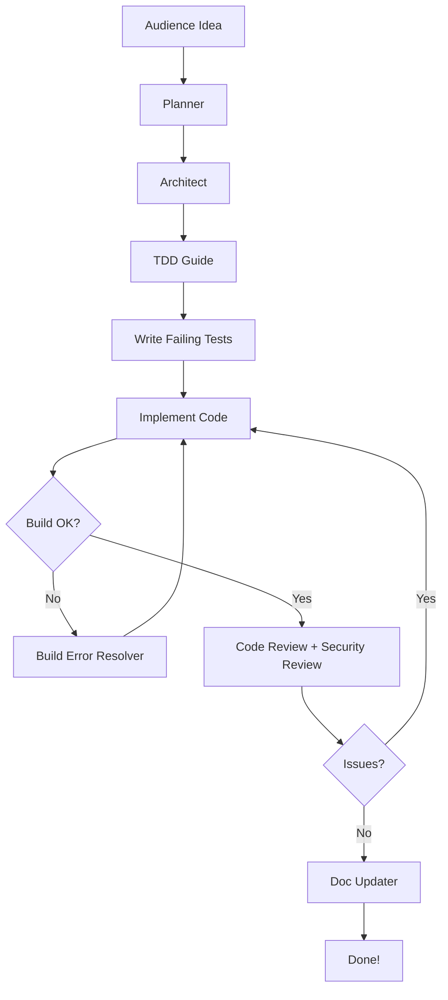
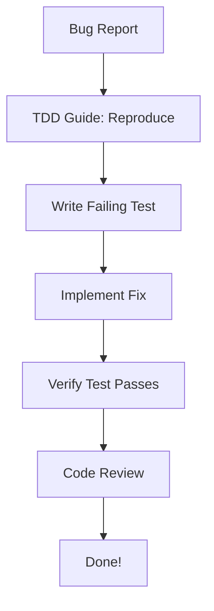
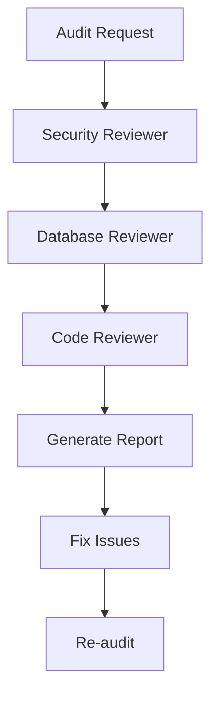

# Agent Swarm Configuration

## Swarm Orchestration Rules

### Agent Invocation Triggers

```yaml
planner:
  triggers:
    - "new feature"
    - "implement"
    - "build"
    - "create"
    - "complex task"
  priority: 1

architect:
  triggers:
    - "design"
    - "architecture"
    - "scalability"
    - "structure"
    - "system design"
  priority: 1
  follows: [planner]

tdd-guide:
  triggers:
    - "test"
    - "TDD"
    - "write tests"
    - "coverage"
  priority: 2
  before: [implementation]

code-reviewer:
  triggers:
    - "review"
    - "after implementation"
    - "code change"
  priority: 3
  after: [implementation]

security-reviewer:
  triggers:
    - "security"
    - "auth"
    - "API"
    - "user input"
    - "sensitive"
  priority: 3
  parallel_with: [code-reviewer]

build-error-resolver:
  triggers:
    - "build error"
    - "TypeScript error"
    - "compilation failed"
  priority: 0  # Highest - blocking issue

go-build-resolver:
  triggers:
    - "go build failed"
    - "go vet error"
    - "Go compilation"
  priority: 0

database-reviewer:
  triggers:
    - "SQL"
    - "database"
    - "query"
    - "schema"
    - "migration"
  priority: 2

refactor-cleaner:
  triggers:
    - "cleanup"
    - "dead code"
    - "refactor"
    - "consolidate"
  priority: 4

e2e-runner:
  triggers:
    - "E2E"
    - "end-to-end"
    - "user flow"
    - "integration test"
  priority: 4

doc-updater:
  triggers:
    - "documentation"
    - "docs"
    - "README"
    - "codemap"
  priority: 5
  after: [implementation, code-reviewer]
```

## Swarm Workflows

### Workflow: Build Something New



### Workflow: Quick Fix



### Workflow: Security Audit



## Agent Communication Protocol

### Handoff Format
```json
{
  "from": "planner",
  "to": "architect",
  "context": {
    "task": "Build CLI tool for file organization",
    "requirements": ["list files", "organize by type", "dry-run mode"],
    "constraints": ["no external dependencies", "cross-platform"]
  },
  "artifacts": {
    "plan": "implementation-plan.md"
  }
}
```

### Status Updates
```json
{
  "agent": "tdd-guide",
  "status": "completed",
  "results": {
    "tests_written": 5,
    "coverage_target": "80%",
    "files_created": ["test/cli.test.ts"]
  },
  "next_agent": "implementation"
}
```

## Parallel Execution Rules

### Safe to Run in Parallel
- code-reviewer + security-reviewer
- database-reviewer + code-reviewer
- e2e-runner + doc-updater

### Must Run Sequentially
- planner → architect → tdd-guide
- implementation → code-reviewer
- build-error-resolver → all others (blocks)

## Demo Mode Settings

```yaml
demo_mode:
  verbose_output: true
  show_agent_handoffs: true
  pause_between_agents: false
  audience_approval_required: false

  highlights:
    - agent_invocation
    - parallel_execution
    - error_resolution
    - code_generation
```

## Agent Capabilities Matrix

| Agent | Read | Write | Edit | Bash | Grep | Glob |
|-------|------|-------|------|------|------|------|
| planner | ✓ | - | - | - | ✓ | ✓ |
| architect | ✓ | - | - | - | ✓ | ✓ |
| tdd-guide | ✓ | ✓ | ✓ | ✓ | ✓ | - |
| code-reviewer | ✓ | - | - | ✓ | ✓ | ✓ |
| security-reviewer | ✓ | ✓ | ✓ | ✓ | ✓ | ✓ |
| build-error-resolver | ✓ | ✓ | ✓ | ✓ | ✓ | ✓ |
| database-reviewer | ✓ | ✓ | ✓ | ✓ | ✓ | ✓ |
| go-build-resolver | ✓ | ✓ | ✓ | ✓ | ✓ | ✓ |
| go-reviewer | ✓ | - | - | ✓ | ✓ | ✓ |
| refactor-cleaner | ✓ | ✓ | ✓ | ✓ | ✓ | ✓ |
| e2e-runner | ✓ | ✓ | ✓ | ✓ | ✓ | ✓ |
| doc-updater | ✓ | ✓ | ✓ | ✓ | ✓ | ✓ |

## Error Handling

### Agent Failure Recovery
```
1. Log the error with full context
2. Attempt retry (max 2 times)
3. If still failing, escalate to human
4. Continue with other agents if possible
5. Mark blocked tasks in todo list
```

### Build Failure Protocol
```
1. STOP all other agents
2. Invoke build-error-resolver immediately
3. Fix errors with minimal changes
4. Resume paused agents
5. Verify build passes before continuing
```
